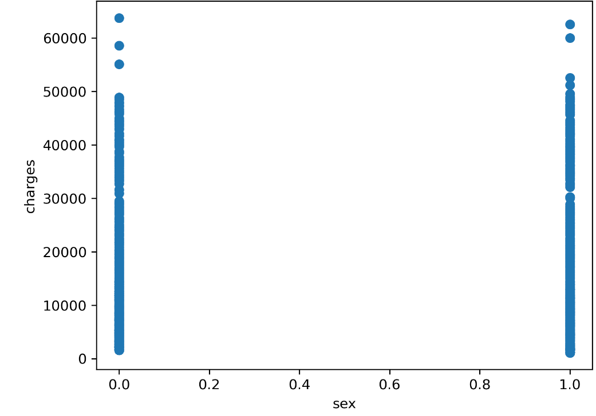
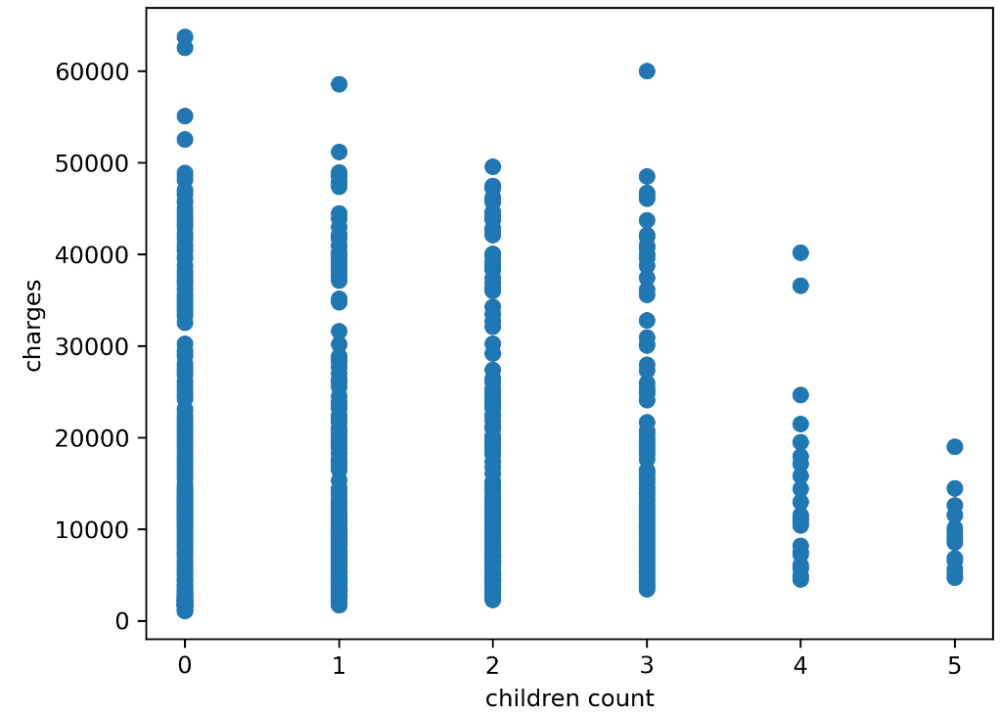
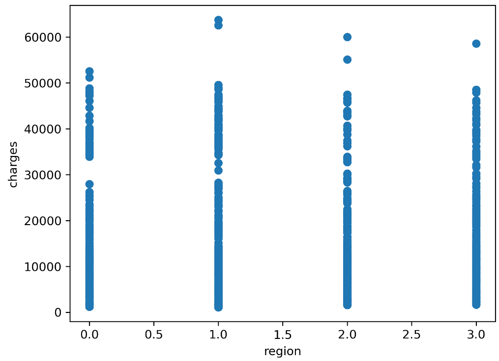
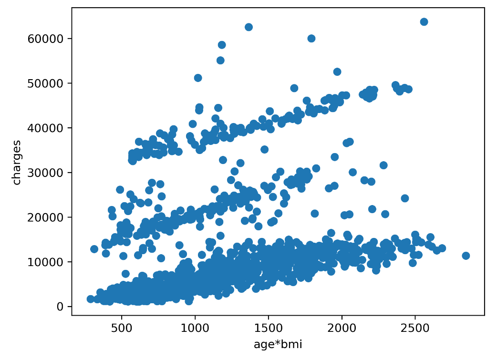

# Insurance Charges Predictor

## Overview
This project develops a machine learning model to predict insurance charges based on personal attributes. The goal is to understand how different factors contribute to insurance costs and to build a predictive model that can estimate charges for new customers.

## Model Performance
The regression model has the following performance metrics:
- **R² Score**: 0.8186
- **Mean Absolute Error (MAE)**: 4210.99
- **Mean Squared Error (MSE)**: 35,171,554.80

These metrics indicate that the model has a good fit to the data, explaining a significant portion of the variance in insurance charges.

## Irrelevant Features
Through exploratory data analysis, it was found that the features 'sex', 'children', and 'region' do not significantly contribute to the predictive power of the model. Scatter plots for each of these attributes are provided below to illustrate their lack of correlation with insurance charges.

- **Sex vs. Charges Scatter Plot**:


- **Children vs. Charges Scatter Plot**:


- **Region vs. Charges Scatter Plot**:


## Important Feature Interaction
One of the key findings from the model is the interaction between 'age' and 'BMI'. The product of these two features is a strong predictor of insurance charges. A scatter plot showing the relationship between this interaction term and insurance charges is provided below.

- **Age*BMI vs. Charges Scatter Plot**:


## Requirements
- Python 3.7 or higher
- Pandas library
- NumPy library
- Scikit-learn library
- Matplotlib library (for plotting)

## Usage
To run the insurance charges predictor, follow these steps:

1. Clone the repository to your local machine.
2. Install the required dependencies:
   ```bash
   pip install pandas numpy scikit-learn matplotlib
3. Run the script:
    ```bash
   python insurance_predictor.py


## Contributing
Contributions are what make the open-source community such an amazing place to learn, inspire, and create. Any contributions you make are **greatly appreciated**.

1. Fork the Project
2. Create your Feature Branch (`git checkout -b feature/AmazingFeature`)
3. Commit your Changes (`git commit -m 'Add some AmazingFeature'`)
4. Push to the Branch (`git push origin feature/AmazingFeature`)
5. Open a Pull Request

## License
Distributed under the MIT License. See `LICENSE` for more information.
